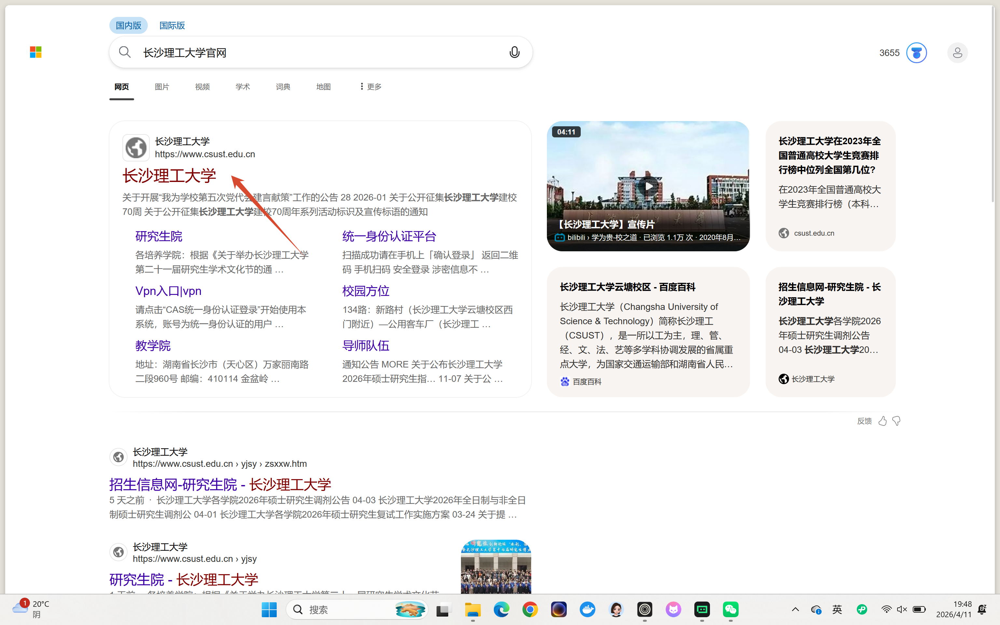
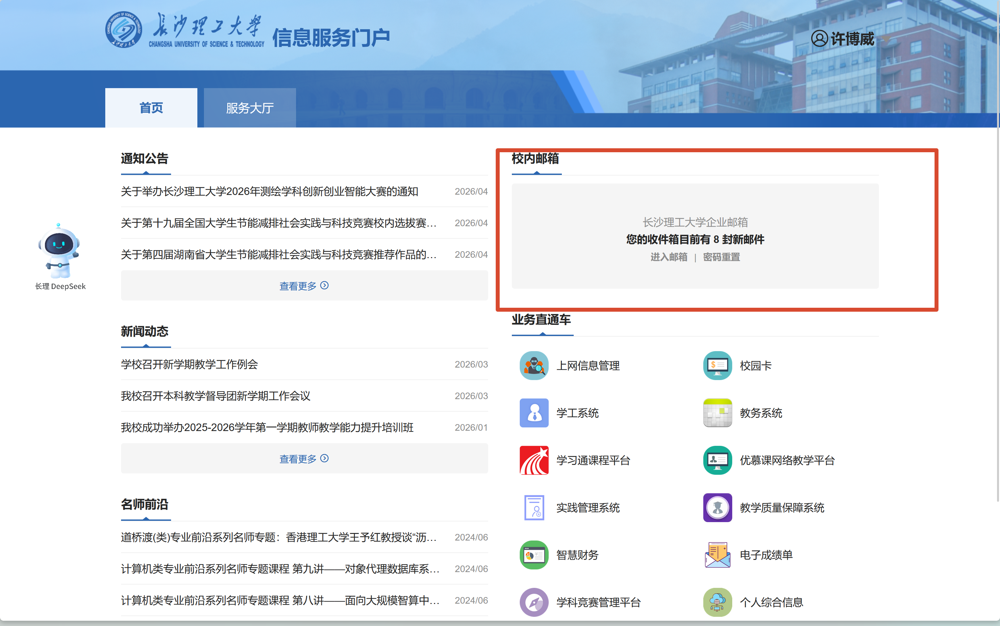

# 学校邮箱开通与登录教程（长沙理工大学）

很多同学第一次使用学校邮箱会找不到入口，按下面 4 步操作即可。

## 第一步：进入学校官网

在浏览器搜索 **“长沙理工大学官网”**，进入学校官网首页。

或者直接点击：

<https://ehall.csust.edu.cn>\
建议认准官方域名，避免点到非官方站点。

## 第二步：打开统一身份认证入口

进入官网后，在页面右上角找到 **“统一认证”**，点击进入。

## 第三步：登录统一身份认证

在统一身份认证页面，使用你的 **学号/工号** 和 **统一身份认证密码** 登录。

- 账号一般是学号（学生）或工号（教职工）
- 如果忘记密码，可先使用页面上的“忘记密码”功能找回

## 第四步：进入信息服务门户并查看校园邮箱

登录成功后会进入信息服务门户，在首页右侧可看到 **“校内邮箱”** 卡片。\
点击 **“进入邮箱”** 即可打开并使用学校邮箱。默认邮箱名一般是：学号+\@csust.edu.cn

## 常见问题

### 1）看不到“校内邮箱”入口怎么办？

- 先确认是否已成功登录统一身份认证
- 退出后重新登录一次
- 更换浏览器（推荐 Edge/Chrome）再试
- 仍无法显示时，联系学校信息化服务部门

### 2）密码正确但登录失败怎么办？

- 确认没有把学号/工号输错
- 检查大小写和输入法全角/半角
- 尝试“忘记密码”重置后再登录

### 3）邮箱是自动开通还是要申请？

多数情况下，账号与统一身份认证关联，登录后即可使用。\
若首次进入提示未开通，按页面提示操作或咨询学校信息化服务部门。
